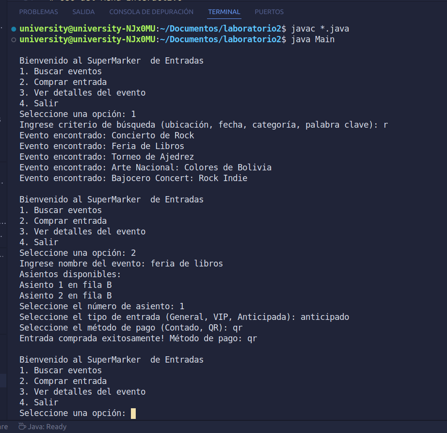

## README.md: Sistema de Venta de Entradas para Eventos

# Descripción
Sistema de venta de entradas que permite buscar, comprar y gestionar entradas para diversos eventos. Ofrece listado de eventos, disponibilidad de entradas, selección de asientos, procesamiento de pagos y opciones de entrega (personal, QR). Los usuarios pueden buscar eventos por ubicación, fecha, categoría o palabra clave y ver detalles del evento. Los organizadores pueden crear y gestionar eventos y generar informes de ventas y asistencia.

# Funcionalidades
Buscar Eventos: Por ubicación, fecha, categoría o palabra clave.
Ver Detalles del Evento: Información detallada del evento.
Comprar Entradas: Selección de asientos y tipos de entradas, con diferentes métodos de pago.
Crear y Gestionar Eventos: Para organizadores.
Opciones de Pago: Pago en efectivo y pago con QR.

Estructura del Proyecto
Asiento: Representa un asiento en un evento.
Entrada: Representa una entrada comprada.
Evento: Representa un evento.
Main: Clase principal con el menú interactivo.
Organizador: Crea y gestiona eventos.
SistemaDeVentaDeEntradas: Maneja la lógica principal del sistema.
TipoEntrada: Representa el tipo de entrada y su precio.
Usuario: Representa a los usuarios que buscan y compran entradas.
Instrucciones de Uso
Compilación
Navegar al directorio del proyecto:

cd /home/university/Documentos/laboratorio2
Compilar todos los archivos Java:

javac *.java
Ejecución
Ejecutar la clase principal Main:

java Main
# Uso del Menú Interactivo
Buscar Eventos:

Opción 1: Ingrese criterio de búsqueda.
Se mostrarán los eventos encontrados.
Comprar Entrada:

Opción 2: Ingrese nombre del evento.
Seleccione número de asiento.
Seleccione tipo de entrada.
Seleccione método de pago.
Confirmación de compra.
Ver Detalles del Evento:

Opción 3: Ingrese nombre del evento.
Se mostrarán los detalles del evento.
Salir:

Opción 4: Salir del sistema.
Ejemplo de Eventos Creados
Concierto de Rock: Metallica.
Feria de Libros: Autores reconocidos y comics.
Torneo de Ajedrez: Para principiantes y expertos.
Arte Nacional: Colores de Bolivia: Autores nacionales.
Bajocero Concert: Rock Indie: Kellen, Los Últimos Glaciales, Aliss.

## Relación de Clases
Agregación
Evento y Asiento: La clase Evento tiene una relación de agregación con la clase Asiento. Un evento puede tener muchos asientos, pero los asientos pueden existir independientemente del evento. Si un evento se elimina, los asientos pueden seguir existiendo o ser reasignados a otro evento.
Composición
Evento y Entrada: La clase Evento tiene una relación de composición con la clase Entrada. Las entradas no pueden existir sin un evento. Si un evento se elimina, todas las entradas asociadas a ese evento también se eliminan.
Herencia
Organizador y Usuario: No hay herencia directa en el diseño actual entre Organizador y Usuario, pero ambos tienen roles definidos que interactúan con el SistemaDeVentaDeEntradas de manera diferente.

